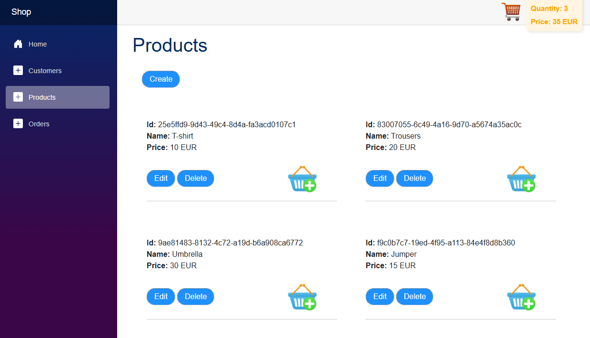
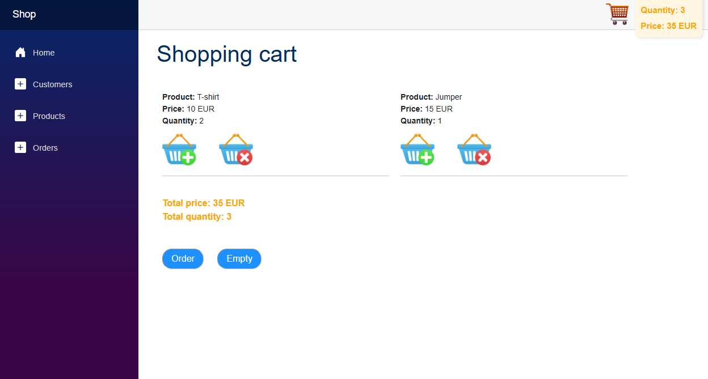
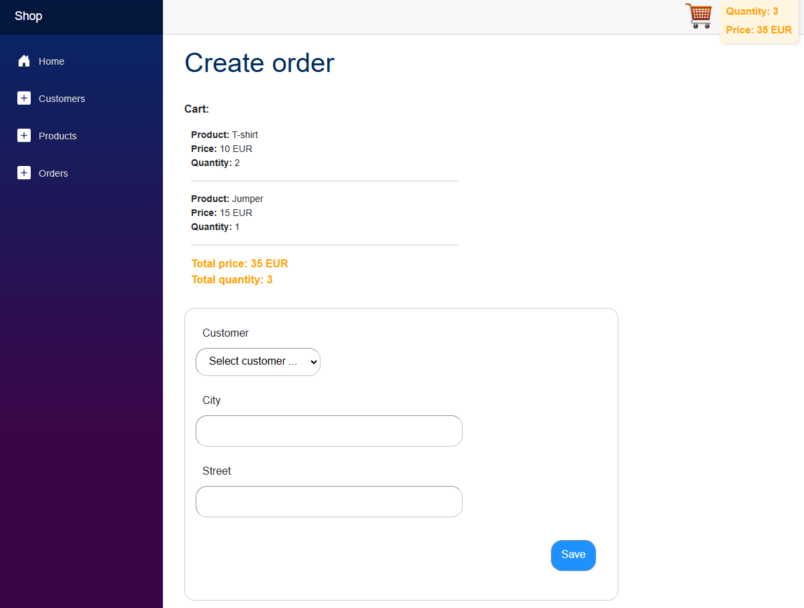
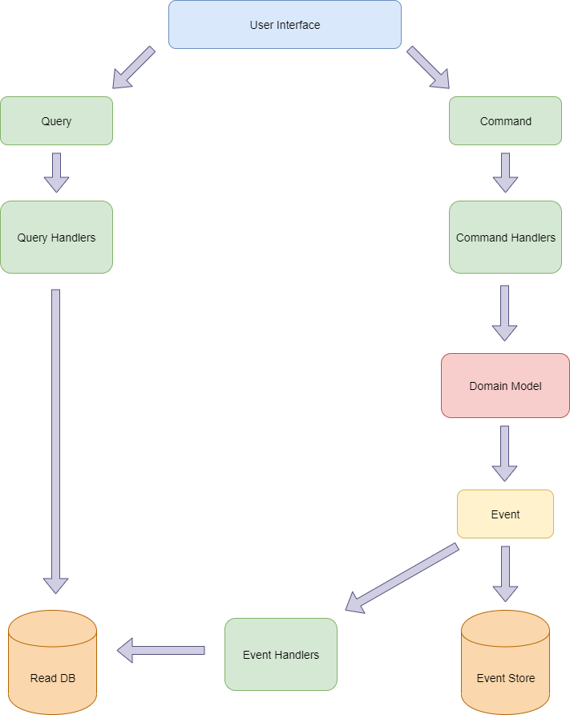

# A simple SHOP

> [!NOTE]
> The products page:


--

> [!NOTE]
> The shopping cart page:


--


> [!NOTE]
> The Order creation page:


--

## Architecture

- Domain-driven design (DDD)
- Event Sourcing
- Clean Architecture
- CQRS

<br/>



<br/><br/>

## Technologies
- .NET 9.0
- C# 13
- Blazor Server
- ASP.NET Core Web API
- MongoDB
- EventStoreDB
- AutoMapper
- NLog
- MediatR
- FluentValidation


## Main layers

| Layer | Description |
| ------ | ------ |
| Shop | API and Blazor application |
| Shop.Application | Communication with Domain Layer |
| Shop.Infrastructure | Persistence |
| Shop.Domain | Core business logic |


## How to run the application
1. Run EventStoreDB with Docker:<br/>
```docker run --name esdb-node -it -p 2113:2113 docker.eventstore.com/eventstore/eventstoredb-ee --insecure --run-projections=All --enable-atom-pub-over-http```
3. Create a MongoDB database in the cloud on https://cloud.mongodb.com (it is free) and fill in appsettings.js in Shop: <br/>
```MongoDbConnectionString``` <br/>
```MongoDbDatabaseName``` <br/>
4. Launch the application!


## The star &#11088;
If you find my project valuable, please click the star on it &#11088;.


## About the Author
Michał Misiukanis
[Linkedin](https://www.linkedin.com/in/micha%C5%82-misiukanis-875129119/)
